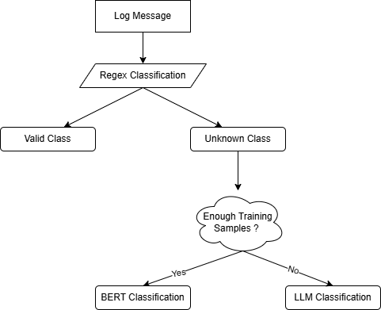

**Log Classification With Hybrid Classification Framework**

This project implements a hybrid log classification system, combining three complementary approaches to handle varying levels of complexity in log patterns. The classification methods ensure flexibility and effectiveness in processing predictable, complex, and poorly-labeled data patterns.

Classifying Logs based on functionality e.g. Security Alert, Resource Usage, Workflow error

## Data flow steps:
	1. We fed the system the aggregated log files (excel/csv)
	2. Classification Approaches
		a. Regular Expression (Regex):
			§ Perform Regex classification technique - Useful for patterns that are easily captured using predefined rules.
		b. Logistic Regression:
			§ For invalid class that is indistinguishable we will train with labelled sample data using algorithm called BERT classification 
			§ Utilizes embeddings generated by Sentence Transformers and applies Logistic Regression as the classification layer.
		c. Large Language Model (LLM):
			§ Unlabelled logs with insufficient training data can be handled by LLM.
Provides a fallback or complementary approach to the other methods.



## 📂 Folder Structure

classifier_processors/
contains bussiness logic for classification of logs based on requirement using LLM/Regex/BERT algotihm


training/
Contains the code for training models using Sentence Transformer and Logistic Regression.
Includes the code for regex-based classification.

models/
Stores the saved models, including Sentence Transformer embeddings and the Logistic Regression model.

resources/
This folder contains resource files such as test CSV files, output files, images, etc.

Root Directory/
server.py	-> Contains the FastAPI server code

requirements.txt	-> Listed down and freeze all the requirements for project

## Prerequisites

Before running the project locally, make sure you have:

- Python `3.13` installed
- `pip` available in your terminal
- A Groq API key if you want LLM-based classification

## Local Setup

### 1. Clone the repository

```bash
git clone <your-repository-url>
cd log-classifier-model
```

### 2. Create and activate a virtual environment

Windows PowerShell:

```powershell
python -m venv venv
.\venv\Scripts\activate
```

macOS/Linux:

```bash
python3 -m venv venv
source venv/bin/activate
```

### 3. Install dependencies

```bash
pip install -r requirements.txt
```

### 4. Configure environment variables

Create a `.env` file in the project root:

```env
GROQ_API_KEY=your_groq_api_key_here
```

Notes:

- The LLM classifier reads `GROQ_API_KEY` from `.env`.
- If you do not plan to classify logs using LLM, the Groq key is still imported by the current classifier module, so adding the key is recommended for a smooth local setup.

### 5. Verify the installation

```bash
python test.py
```

If setup is correct, you should see:

```text
All imports successful
```

## Run the Project Locally

### Option 1: Run the FastAPI app

Start the local API server:

```bash
uvicorn server:app --reload
```

Open `http://127.0.0.1:8000` in your browser. The root endpoint should return:

```json
{"message": "Log Classification API is running"}
```

### Option 2: Run CSV log classification

The project includes a sample input file at `resources/test_split.csv`.

Run:

```bash
python classifier_processors/classify.py
```

This reads `resources/test_split.csv` and writes the classified output to:

```text
resources/test_split_classified.csv
```

## Training Assets

- `training/training.ipynb` contains the notebook used for model training
- `models/log_classifier.joblib` is the saved trained classifier used during inference

## Notes for New Contributors

- The Sentence Transformer model may download on first run, depending on your local cache.
- Keep `models/log_classifier.joblib` in place, since the classifier loads it from the project root.
- The sample files inside `resources/` are useful for a first local test after cloning the repo.